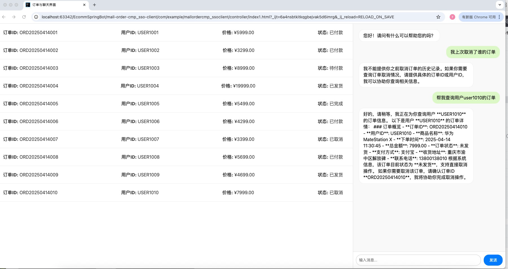

# 使用Spring AI Alibaba实现的智能客服 

> Spring AI Alibaba Repo: https://github.com/alibaba/spring-ai-alibaba
>
> Spring AI Alibaba Website:  https://java2ai.com
>
> Spring AI Alibaba Website Repo: https://github.com/springaialibaba/spring-ai-alibaba-website

## 介绍

此仓库中包含许多 Example 模块项目来介绍 Spring AI 和 Spring AI Alibaba 从基础到高级的各种用法和 AI 项目的最佳实践。
更详细的介绍介绍请参阅每个子项目中的 README.md 。
 #### mall-order 模块
    普通的service模块，查询数据库数据，提供业务需求服务，如查询所有订单，根据用户名查询订单，取消订单等。
#### mail-order-cmp-server 模块
    自定义的cmp-server，提供查询，取消订单等工具
#### mail-order-cmp_sso-client
     通过sso方式连接cmp-server，提供control接口。使用redis实现对话记忆功能。
#### mail-order-es-rag
    使用es提供知识库功能。嵌入模型选择：text-embedding-v1

## 前端页面

